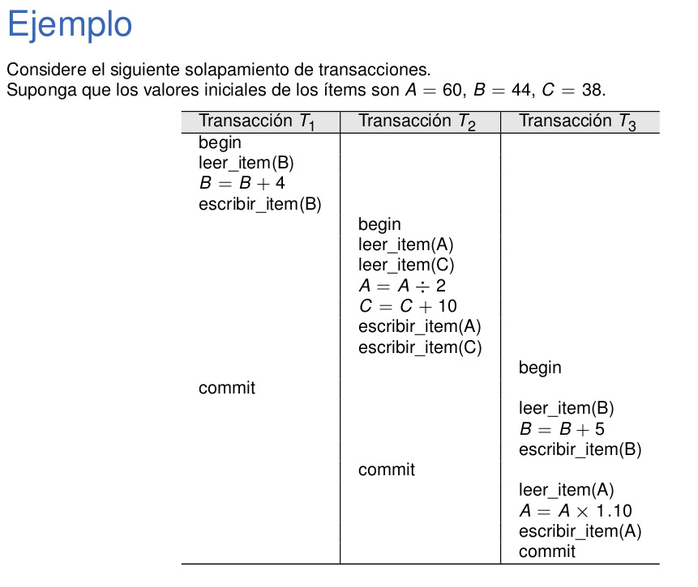
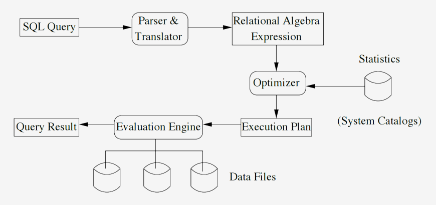
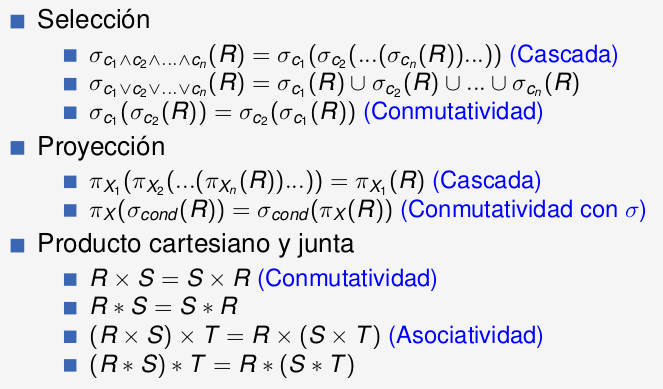
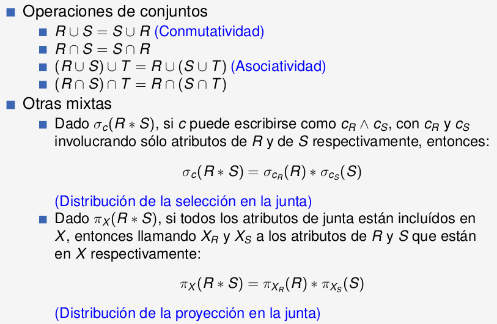
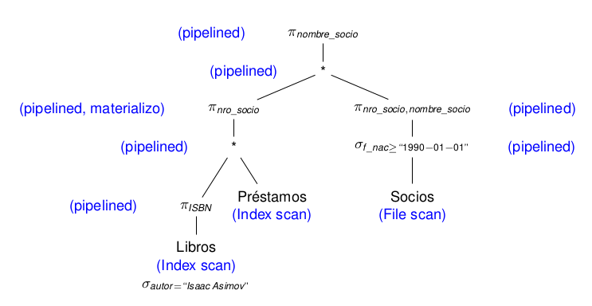

# Resumen

## Concurrencia

La concurrencia es la posibilidad de ejecutar múltiples
transacciones (tareas, en la jerga de los sistemas operativos) en
forma simultánea.

- Consideraremos que nuestra base de datos está formada por
ítems.
- Un ítem puede representar:
  - El valor de un atributo en una fila determinada de una tabla.
  - Una fila de una tabla.
  - Un bloque del disco.
  - Una tabla.
- Las instrucciones atómicas básicas de una transacción sobre la
base de datos serán:
  - **leer_item(X)**: Lee el valor del ítem X , cargándolo en una variable
en memoria
  - **escribir_item(X)**: Ordena escribir el valor que está en memoria del
ítem X en la base de datos

## Transacción

Es una unidad lógica de trabajo en los SGBD.
Es una secuencia ordenada de instrucciones que deben ser
ejecutadas en su totalidad o bien no ser ejecutadas, al margen de
la interferencia con otras transacciones simultáneas.

## Propiedades ACID

- **Atomicidad**: Desde el punto de vista del usuario, las transacciones
deben ejecutarse de manera atómica. Esto quiere decir que, o bien
la transacción se realiza por completo, o bien no se realiza.
- **Consistencia**: Cada ejecución, por sí misma, debe preservar la
consistencia de los datos. La consistencia se define a través de
reglas de integridad: condiciones que deben verificarse sobre los
datos en todo momento.
- **aIslamiento**: El resultado de la ejecución concurrente de las
transacciones debe ser el mismo que si las transacciones se
ejecutaran en forma aislada una tras otra, es decir en forma serial.
La ejecución concurrente debe entonces ser equivalente a alguna
ejecución serial.
- **Durabilidad**: Una vez que el SGBD informa que la transacción se
ha completado, debe garantizarse la persistencia de la misma,
independientemente de toda falla que pueda ocurrir.

Para garantizar las propiedades ACID se agregan a la secuencia de instrucciones de cada transacción algunas instrucciones especiales:

- **begin**: Indica el comienzo de la transacción.
- **commit**: Indica que la transacción ha terminado exitosamente, y se
espera que su resultado haya sido efectivamente almacenado en
forma persistente.
- **abort**: Indica que se produjo algún error o falla, y que por lo tanto
todos los efectos de la transacción deben ser deshechos (rolled
back).


## Anomalías

- **Lectura sucia (dirty read)**: se presenta cuando una transacción $T_2$ lee un ítem que ha sido modificado por otra transacción $T_1$. Si luego $T_1$ se deshace, la lectura que hizo $T_2$ **no es válida** en el sentido de que la ejecución resultante puede no ser equivalente a una ejecución serial de las transacciones. Es un conflicto de tipo WR: $W_{T_1}(X)...R_{T_2}(X)...(a_{T_1} ó c_{T_1}).$

Ejemplo:


- **Actualización perdida (lost update)**: ocurre cuando una transacci'on modifica un ítem que fue leído anteriormente por una primera transacción que aún no terminó. Si la primera transacción luego modifica y escribe el ítem que leyó, el valor escrito por la segunda se perderá.
- **Lectura no repetible (unrepeatable read)**:  Si en cambio la primera transacción volviera a leer el ítem luego de que la segunda lo escribiera, se encontraría con un valor distinto.

Ambas situaciones presentan un conflicto de tipo RW seguido por otro de tipo WW ó WR, respectivamente $R_{T_1}(X)...W_{T_2}(X)...(a_{T_1} ó c_{T_1})$

Ejemplo:


- **Escritura sucia (dirty write)**: ocurre cuando una transacción $T_2$ escribe un ítem que ya había sido escrito por otra transacción $T_1$ que luego se deshace. El problema se datá si los mecanismos de recuperación vuelven al ítem a su valor inicial, deshaciendo la modificación realizada por $T_2$. Es un conflicto WW: $W_{T_1}(X)...W_{T_2}(X)...(a_{T_1} ó c_{T_1})$

- **Fantasma (phantom)**: se produce cuando una transacción $T_1$ observa un conjunto de ítems que cumplen determinada condición, y luego dicho conjunto cambia porque algunos de sus ítems son modificados/creados/eliminados por otra transacción $T_2$. Si esta modificación se hace mientras $T_1$ aún se está ejecutando, $T_1$ podría encontrarse con que el conjunto de ítems que cumplen la condición cambió. Caracterización: $R_{T_1}(\{X|cond\})...W_{T_2}(X_{cond})...(a_{T_1} ó c_{T_1})$

## Serializabilidad

Notación:

- $R_T(X)$: La transacción T lee el ítem X.
- $W_T(X)$: La transacción T escribe el ítem X.
- $b_T$: Comienzo de la transacción T.
- $c_T$: La transacción T realiza el *commit*.
- $a_T$: Se aborta la transacción T (abort).

## Solapamiento

- Un solapamiento entre 2 transacciones $T_1$ y $T_2$ es una lista de $m(T_1) + m(T_2)$ instrucciones, en donde cada instrucción de $T_1$ y $T_2$ aparece una única vez, y las instrucciones de cada transacción consrvan el orden entre ellas dentro del solapamiento.
- Existen ${(m(T_1)+m(T_2))! \over m(T_1)!m(T_2)!}$ distintos solapamientos.


## Ejecución serial

- Dado un conjutno de transacciones $T_1, T_2, ..., T_n$ una ejecución serial es aquella en que las transacciones se ejecutan por completo una detrás de otra, en base a algún orden $T_{i_1}, T_{i_2}, ..., T_{i_n}$.
- Existen $n!$ distintas ejecuciones seriales.

## Serializabilidad

Un solapamiento de un conjunto de transacciones $T_1, T_2, ..., T_n$ es **serializable** cuando la ejecución de sus instrucciones en dicho orden deja a la base de datos en un estado *equivalente* a aquel en que la hubiera dejado alguna ejecución serial de $T_1, T_2, ..., T_n$.
La serializabilidad garantiza la propiedad de aislamiento.

## Equivalencia de solapamientos

- **Equivalencia de resultados**: Cuando, dado un estado inicial particular, ambos órdenes de ejcución dejan a la base de datos en el mismo estado.
- **Equivalencia de conflictos**: Cuando ambos órdenes de ejecución
poseen los mismos **conflictos** entre instrucciones. (No depende del estado inicial de la base de datos).
- **Equivalencia de vistas**: Cuando en cada órden de ejecución, cada
lectura $R_{T_i}(X)$ lee el valor escrito por la misma transacción $j$, $W_{T_j}(X)$. Además se pide que en ambos órdenes la última
modificación de cada ítem $X$ haya sido hecha por la misma
transacción.

## Conflictos

Dado un orden de ejecución, un conflicto es un par de instrucciones ($I_1, I_2$) ejecutadas por 2 transacciones distintas $T_i$ y $T_j$, tales que $I_2$ se encuentra más tarde que $I_1$ en el orden, y que respode a alguno de los siguientes esquemas:
  - ($R_{T_i}(X), W_{T_j}(X)$): Una transacción escribe un ítem que otra leyó.
  - ($W_{T_i}(X), R_{T_j}(X)$): Una transacción lee un ítem que otra escribió.
  - ($W_{T_i}(X), W_{T_j}(X)$): Dos transacciones escriben un mismo ítem.

Todo par de instrucciones consecutivas ($I_1, I_2$) de un solapamiento que no constituye un conflicto puede ser invertido en su ejecución obteniendo un solapamiento equivalente por conflictos al inicial.

## Grafo de precedencias

Dado un conjunto de transacciones $T_1, T_2, ..., T_n$ que acceden a determinados ítems $X_1, X_2, ..., X_p$, el grafo de precedencias es un *grafo dirigido simple* que se construye de la siguiente forma:

1. Se crea un nodo por cada transacción $T_1, T_2, ..., T_n$.
2. Se agrega un arco entre los nodos $T_i$ y $T_j$ (con $i \ne j$) si y sólo si existe algún conflicto de la forma $(R_{T_i}(X_k), W_{T_j}(X_k)), (W_{T_i}(X_k), R_{T_j}(X_k)) ó (W_{T_i}(X_k), W_{T_j}(X_k))$.

Cada arco ($T_i, T_j$) en el grafo representa una precedencia entre $T_i$ y $T_j$, e indica que para que el resultado sea equivalente por conflictos a una ejecución serial, entonces en dicha ejecución serial $T_i$ debe ejecutarse antes que $T_j$.


Un orden de ejecución es serializable por conflictos si y sólo si su grafo de precedencias no tiene ciclos.

## Control de concurrencia

- **Lock**


En general, los SGBD impementan locks de varios tipos. Los dos tipos de locks principales son:
- Locks de escritura o "de acceso exclusivo" ($L_{EX}(X)$)
- Locks de lectura o "de acceso compartido" ($L_{SH}(X)$)


- **Protocolo de lock de dos fases (2PL)**: Una transacción no puede adquirir un lock luego de haber liberado un lock que había adquirido. Existen 2 fases:
  - Una de adquisición de locks, en la que la cantidad de locks adquiridos crece.
  - Una de liberación de locks, en que la cantidad de locks adquiridos decrece.

Este protocolo garantiza que cualquier orden de ejecución de un conjunto de transacciones sea serializable.

#### Deadlock

Condición en que un conjunto de transacciones quedan cada una de ellas bloqueada  la espera de recursos que otra de ellas posee.
- Mecanismos de prevención:
  1. Que cada transacción adquiera todo los locks que necesita antes de comenzar su primera instrucción, y en forma simultánea.
  2. Definir un ordenamiento de los recursos.
  3. Métodos basados en timestamps.

La inanición es una condición vinculada con el deadlock, y ocurre cuando una transacción no logra ejecutarse por un período de tiempo indefinido.


## Control de concurrencia basado en timestamps

- Se asigna a cada transacción $T_i$ un timestamp $TS(T_i)$ (p. ej> un número de secuencia o la fecha actual del reloj).
- Los timestamps deben ser únicos.
- Se permite la ocurrencia de conflictos, pero siempre que las transacciones de cada conflicto aparezcan de acuerdo al orden serial equivalente: $(W_{T_i}(X), R_{T_j}(X)) \rightarrow TS(T_i) < TS(T_j)$
- Este método está exento de deadlocks.
- Se debe mantener en todo instante, **para cada ítem X**, la siguiente información:
  - **read_TS(X)**: Es el TS(T) correpondiente a la transacción más joven -de mayor TS(T)- que leyó el ítem X.
  - **write_TS(X)**: Es el TS(T) correpondiente a la transacción más joven -de mayor TS(T)- que escribió el ítem X.
- Lógica:
  1. Cuando una transacción $T_i$ quiere ejecutar un $R(X)$:
     1. Si una transacción posterior $T_j$ modificó el ítem, $T_i$ deberá ser abortada (read too late).
     2. De lo contrario, actualiza $read\_TS(X)$ y lee.
  2. Cuando una transacción $T_i$ quiere ejecutar un $W(X)$:
     1. Si una transacción posterior $T_j$ leyó o escribió el ítem, $T_i$ deberá ser abortada (write too late).
     2. De lo contrario, actualiza $write\_TS(X)$ y escribe.

## Snapshot Isolation

Cuando 2 transacciones intentan modificar un mismo ítem de datos, generalmente gana aquella que hace primero su commit, mientras que la otra deberá ser abortada (first-commiter-wins).

## Solución a la anomalía del fantasma

1. Bajo control de concurrencia basado en locks:
   1. Locks de tablas: cuando se lee un X con una dada condición, bloquear el acceso a toda la tabla a la que X pertenece.
   2. Locks de predicados: bloquear todas aquellas tuplas que podrían cumplir la condición.
2. Bajo Snapshot Isolation
   1. Locks de predicados
3. Bajo control de concurrencia basado en timestamps:
   1. Utilizar índices de tipo árbol, y mantener registros $read\_TS(I)$ y $write\_TS(I)$ también para los nodos del árbol.

## Recuperabilidad

Un solapamiento es recuperable si y sólo si ninguna transacción T realiza el commit hasta tanto todas las transacciones que escribieron datos antes de que T los leyera hayan commiteado.


El log almacena generalmente los siguientes registros:
- $(BEGIN, T_{id})$
- $(WRITE, T_{id}, X, X_{old}, X_{new})$
- $(READ, T_{id}, X)$
- $(COMMIT, T_{id})$
- $(ABORT, T_{id})$

#### Rollback

- Si las modificaciones hechas por $T_j$ no fueron leídas por nadie, entonces basta con procesar el log de $T_j$ en forma inversa para deshacer sus efectos (rollback).
- Pero si una transacción $T_i$ leyó un dato modificado por $T_j$, entonces será necesario hacer el rollback de $T_i$ para volverla a ejecutar.
- Que un solapamiento sera recuperable, no implica que no sea necesario tener que hacer rollbacks en cascada de transacciones que aún no commitearon.
- Para evitar rollbacks en cascada es necesario que no existan conflictos de la forma $(W_{T_i}(X); R_{T_j}(X))$ sin que en el medio haya un commit $c_{T_i}$.

#### Protocolo de lock de dos fases estricto (S2PL)

Una transacción no puede adquirir un lock luego de haber liberado un
lock que había adquirido, y además los locks de escritura sólo pueden
ser liberados después de haber commiteado la transacción.

#### Protocolo de lock de dos fases riguroso (R2PL)

Los locks sólo pueden ser liberados después del commit.

S2PL y R2PL garantizan que todo solapamiento sea
no sólo serializable, sino también recuperable, y que no se
producirán cascadas de rollbacks al deshacer una transacción.

## Niveles de aislamiento

1. Read Uncommitted: Es la carencia total de aislamiento: No se
emplean locks, y se accede a los ítems sin tomar ninguna
precaución.
2. Read Committed: Evita la anomalía de lectura sucia.
3. Repeatable Read: Evita la lectura no repetible y la lectura sucia.
4. Serializable: Evita todas las anomalías, y asegura que el resultado
de la ejecución de las transacciones es equivalente al de algún
orden serial.


## NoSQL

#### Fragmentación

- La fragmentación es la tarea de dividir un conjunto de agregados
entre un conjunto de nodos.
- Se realiza con dos objetivos:
  - Almacenar conjuntos muy grandes de datos que de lo contrario no
podrían caber en un único nodo.
  - Paralelizar el procesamiento, permitiendo que cada nodo ejecute
una parte de las consultas para luego integrar los resultados.
- Según la manera de fragmentar, podemos distinguir entre:
  - Fragmentación horizontal: Los agregados se reparten entre los
nodos, de manera que cada nodo almacena un subconjunto de
agregados. Generalmente se asigna el nodo a partir del valor de
alguno de los atributos del agregado.
  - Fragmentación vertical: Distintos nodos guardan un subconjunto
de atributos de cada agregado. Todos suelen compartir los
atributos que conforman la clave.

#### Replicación

- La replicación es el proceso por el cual se almacenan múltiples
copias de un mismo dato en distintos nodos del sistema.
- Nos brinda varias ventajas:
  - Es un mecanismo de backup: permite recuperar el sistema en caso
de fallas de disco o catastróficas.
  - Permite repartir la carga de procesamiento si permitimos que las
réplicas respondan consultas o actualizaciones.
  - Garantiza cierta disponibilidad del sistema aún si se caen algunos
nodos.
- Cuando las réplicas sólo funcionan como mecanismo de backup
se denominan réplicas secundarias. Cuando también pueden
hacer procesamiento, se las conoce como réplicas primarias.
- La replicación nos genera un nuevo problema a resolver: la
consistencia de los datos.
  - Puede darse la situación de que distintas réplicas almacenen (al
menos, temporalmente) distintos valores para un mismo dato.


## Clave-valor

Las bases de datos clave-valor (key-value stores) almacenan
vectores asociativos ó diccionarios, es decir conjuntos formados
por pares de elementos de forma (clave, valor).

- Este tipo de bases de datos tiene cuatro operaciones
elementales:
  - Insertar un nuevo par (put)
  - Eliminar un par existente (delete)
  - Actualizar el valor de un par (update)
  - Encontrar un par asociado a una clave particular (get)
- Sus ventajas son:
  - Simplicidad
    - No se define un esquema.
    - No hay DDL’s, restricciones de integridad, ni dominios.
    - El agregado es mínimo, y está limitado al par.
    - El objetivo es guardar y consultar grandes cantidades de datos, pero
no de interrelaciones entre los datos.
  - Velocidad
    - Ya que se prioriza la eficiencia de acceso por sobre la integridad de
los datos.
  - Escalabilidad
    - Generalmente proveen replicación (ya sea maestro-esclavo ó
distribuida) y permiten repartir las consultas entre los nodos.


## Hashing consistente

- Disponemos de una función de hash $h()$ que, dada una clave $k$,
devuelve un valor $h(k)$ entre $0$ y $2^M−1$, en donde $M$ representa la
cantidad de bits del resultado.
- El valor de la función de hash para un par dado es lo que
determina en cuál de los $S$ nodos el mismo será almacenado.
Esto es lo que se conoce como una tabla de hash distribuida
(DHT).
- A diferencia de otras DHT’s en que el nodo asignado se
determina como $h(k)$ $mod$ $S$, en Dynamo se utiliza una técnica
ligeramente distinta, conocida como hashing consistente.

Al identificador de cada nodo de procesamiento (generalmente,
su dirección IP) se le aplica la misma función de hash. A partir de
los hashes, los nodos se organizan virtualmente en una
estructura de anillo por hash creciente.


Regla: Un par $(k, v)$ se replicará en los N servidores siguientes a
$h(k)$, que conformarán el listado de preferencia para esa clave.

## Modelos de consistencia

- **Consistencia secuencial**: Partimos de una serie de procesos que ejecutan instrucciones de lectura, $R_{P_i}(X)$ y de escritura, $W_{P_i}(X)$, sobre una base de datos distribuida.
- Se dice que una base de datos distribuida tiene consistencia secuencial cuando “el resultado de cualquier ejecución concurrente de los procesos es equivalente al de alguna ejecución secuencial en que las instrucciones de los procesos se ejecutan una después de otra”.
- Para indicar el valor leído/escrito utilizaremos esta notación:
  - $R(X)a$ indica que el proceso leyó el valor $a$ del ítem $X$.
  - $W(X)b$ indica que el proceso escribió el valor $b$ en el ítem $X$.


- **Consistencia causal**: Si un evento b fue influenciado por un evento a, la causalidad requiere que todos vean al evento a antes que al evento b.


- **Consistencia eventual**: Decimos que una ejecución tiene consistencia eventual cuando “si en el sistema no se producen modificaciones (escrituras) por un tiempo suficientemente grande, entonces eventualmente todos los procesos verán los mismos valores”.

- Se definen dos parámetros adicionales:
  - W ≤ N: Quorum de escritura
  - R ≤ N: Quorum de lectura
- Quorum de escritura W
  - Un nodo puede devolver un resultado de escritura exitosa luego de
recibir la confirmación de escritura de otros W − 1 nodos del
listado de preferencia.
  - W = 2 ofrece un nivel de replicación mínimo.
- Quorum de lectura R
  - Un nodo puede devolver el valor de una clave leída luego de
disponer de la lectura de R nodos distintos (incluído él mismo).
  - En muchas situaciones R = 1 es ya suficiente.
  - Valores mayores de R brindan tolerancia a fallas como corrupción
de datos ó ataques externos, pero hacen más lenta la lectura.

Algunos valores comunes de R y W son:

|   N   |   R   |   W   |                                                                |
| :---: | :---: | :---: | :------------------------------------------------------------- |
|   3   |   2   |   2   | Buena durabilidad y latencia.                                  |
|   3   |   3   |   1   | Lectura más lenta, pero pobre durabilidad. Escritura rápida.   |
|   3   |   1   |   3   | Escrituras más lentas. Muy buena durabilidad y lectura rápida. |

## Bases de datos orientadas a documentos

- En las bases de datos orientadas a documentos, un documento
es una unidad estructural de información (agregado), que
almacena datos bajo una cierta estructura.
- Generalmente, un documento se define como
un conjunto de pares clave: valor que representan los atributos
del documento y sus valores. Se admiten atributos multivaluados,
y también se admite que el valor de un atributo sea a su vez un
documento.

### MongoDB

- El pipeline de agregación de MongoDB ofrece las siguientes
operaciones, entre otras:
  - match: Filtrado de resultados.
  - group: Agrupamiento de los resultados por uno o más atributos,
aplicando funciones de agregación.
  - sort: Ordenamiento de resultados.
  - limit: Limitado de resultados.
  - sample: Selección aleatoria de resultados.
  - unwind: Deconstrucción de un atributo de tipo vector.

#### Sharding

- MongoDB utiliza un modelo distribuido de procesamiento,
conocido como sharding.
- Se basa en el particionamiento horizontal de las colecciones en
chunks que se distribuyen en nodos denominados shards. Cada
shard contendrá un subconjunto de los documentos de cada
colección.
- Un sharding cluster de MongoDB está formado por distintos tipos
de nodos de ejecución:
  - Los **shards (fragmentos)**: Son los nodos en los que se distribuyen
los chunks de las colecciones. Cada shard corre un proceso
denominado mongod.
  - Los **routers**: Son los nodos servidores que reciben las consultas
desde las aplicaciones clientes, y las resuelven comunicándose
con los shards. Corren un proceso denominado mongos.
  - Los **servidores de configuración**: Son los que almacenan la
configuración de los routers y los shards.
- El particionado de las colecciones se realiza a partir de una shard
key. La shard key es un atributo ó conjunto de atributos de la
colección que se escoge al momento de construir el sharded
cluster.
- La asignación de documentos a shards se hace dividiendo en
rangos los valores de la shard key (range-based sharding), o bien
a partir de una función de hash aplicada sobre su valor (hashed
sharding).
- En un contexto de sharding es posible tener algunas colecciones
sharded (fragmentadas) y otras unsharded (no fragmentadas).
Las colecciones unsharded de una base de datos se
almacenarán en un shard particular del cluster, que será el shard
primario para esa base de datos.
- La realización de un sharding sobre una colección posee las
siguientes restricciones:
  1. Es conveniente que la shard key esté definida en todos los
documentos de la colección.
  1. La colección deberá tener un índice que comience con la shard
key.
  3. Desde MongoDB 5.0, una vez realizado el sharding se puede
cambiar la shard key y desde la versión 4.2 se puede cambiar
(update) su valor.
  4. No es posible defragmentar (unshard) una colección que ya fue
fragmentada (sharded) .
- El sharding permite:
  - Disminuir el tiempo de respuesta en sistemas con alta carga de
consultas, al distribuir el trabajo de procesamiento entre varios
nodos.
  - Ejecutar consultas sobre conjuntos de datos muy grandes que no
podrían caber en un único servidor.

#### Replicación

- El esquema de réplicas es de master-slave with automated
failover (maestro-esclavo con recuperación automática):
  - Cada shard pasa a tener un servidor mongod primario (master ), y
uno o más servidores mongod secundarios (slaves). El conjunto
de réplicas de un shard se denomina replica set.
  - Las réplicas eligen inicialmente un master a través de un algoritmo
distribuido.
  - Cuando el master falla, los slaves eligen entre sí a un nuevo
master.
- También los servidores de configuración se implementan como
replica sets.
- Todas las operaciones de escritura sobre el shard se realizan en
el master. Los slaves sólo sirven de respaldo.

Ejemplos:

```js
db.compras.aggregate([
	{ $match: { "productos.codigo_producto": { $in: [108431] }}},
	{ $unwind: "$productos" },
	{ $group: {
		_id: "$productos.codigo_producto",
		cantidad_tickets_compra: { $sum: 1},
	}},
	{ $match: { "_id": { $ne: 108431 }}},
	{ $sort: { count: -1 }},
	{ $limit: 5 }
])
```

```js
db.graduados.aggregate([
	{ $project: {
		_id: "$padron",
		promedio: { $trunc:
     [{ $divide: 
      [{ $sum: "$notas.nota_final" }, { $size: "$notas" } ]}, 1
     ]}}
	},
	{ $group: {
		_id: "$promedio", cantidad_alumnos: { $sum: 1 }
	}},
	{ $project: {
		_id: 0,
		nota_promedio: "$_id",
		cantidad_alumnos: "$cantidad_alumnos"
	}},
	{ $sort: { nota_promedio: 1} }
])
```

## Bases de datos wide column

### Cassandra

- Una fila está formada por:
  - Una clave compuesta (atributo ó conjunto de atributos)
  - Un conjunto de pares clave-valor ó columnas


```sql
CREATE COLUMNFAMILY clientes (
nro_cliente int,
nombre text static,
ISBN bigint,
nombre_libro text,
primary key ((nro_cliente), ISBN));
```

- Para diseñar una base de datos en Cassandra debemos tener en
cuenta los siguientes puntos:
  1. No existe el concepto de junta. Si para alguna consulta típica
necesitamos el resultado de una junta, entonces debemos
guardarla como una tabla desnormalizada más desde el comienzo.
  2. No existe el concepto de integridad referencial. Si la necesitamos,
debe ser manejada desde el nivel de aplicación.
  3. Desnormalización de datos. En las bases de datos NoSQL el uso
de tablas no normalizadas está a la orden del día, y básicamente
por un único motivo: performance.
  4. Diseño orientado a las consultas.


- Cassandra está optimizado para altas tasas de escritura.
- Utiliza una estructura de búsqueda denominada LSM-tree
(log-structured merge tree), que mantiene parte de sus datos en
memoria, para diferir los cambios sobre el índice en disco.
- Se busca acceder en forma secuencial a disco, para mejorar el
trade-off entre el costo de hacer un disk seek y el costo de un
buffer en memoria. Esto ha sido bastante estudiado y se conoce
como regla de los cinco minutos (Five-minute Rule).


- Consideraciones:
  - Desde que se inserta una entrada en $C_0$ hasta que se traslada a
$C_1$ habrá una demora.
  - El costo de I/O de escritura en $C_0$ es nulo.
  - Cuando el tamaño de $C_0$ alcanza un umbral se inicia un proceso de
rolling merge (flush).
- El árbol $C_1$ suele tener una estructura similar a un B-tree.
- En cambio, como $C_0$ está en memoria no es relevante minimizar
su profundidad $\rightarrow$ suelen emplearse árboles balanceados como el
2-3 tree o el árbol AVL.

## Bases de datos basadas en grafos

- En las bases de datos basadas en grafos los elementos
principales son nodos y arcos (ejes).
- Estas bases de datos resultan útiles para modelar interrelaciones
complejas entre las entidades.
- Organizar nuestra base de datos de esta forma nos provee
ventajas para resolver problemas clásicos de grafos como:
  - Encontrar patrones de nodos conectados entre sí.
  - Encontrar caminos entre nodos.
  - Encontrar la ruta más corta entre dos nodos.
  - Calcular medidas de centralidad asociadas a los nodos.

### Neo4J

Ejemplos:

```sql
MATCH(n:Person) WHERE n.surname = "Smith" 
RETURN n.name ORDER BY n.name LIMIT 10

MATCH (v:Vehicle) WHERE v.year = "2013" RETURN v.make, v.model

MATCH(o:Officer) WHERE o.surname STARTS WITH "Mc" 
RETURN o.name, o.surname ORDER BY o.rank

MATCH (l:Location)-[:LOCATION_IN_AREA]->(a:Area{areaCode: 'M30'})
RETURN COUNT(l)

MATCH (p1:Person)-[:KNOWS*2]-(p2:Person 
{name: "Craig", surname: "Gordon"}) 
RETURN p1

MATCH(n:Person)-[:KNOWS]->(x:Person)-
[:KNOWS]->(m:Person 
{surname:"Gordon", name:"Craig"}) RETURN n,x,m

MATCH (p1:Person)-[:KNOWS*..2]-(p2:Person 
{name: "Craig", surname: "Gordon"}) RETURN p2, p1

MATCH s=shortestPath((n:Person)-[*]-(m:Person 
{surname:"Gordon", name:"Craig"}))
WHERE LENGTH(s) = 3
RETURN n

MATCH(p1:Person)-[*3..3]->(p2:Person
{surname:"Gordon", name:"Craig"}) 
RETURN p1

MATCH(n:Person)-[:KNOWS]-(m:Person
{surname:"Brooks", name:"Roger"})
WHERE NOT (n)-[:PARTY_TO]-(:Crime) 
RETURN n 

MATCH s=shortestPath( (P1:Person
{name:"Judith", surname:"Moore"})-[*]-(P2:Person
{name:"Richard",surname:"Green"}))
RETURN s

MATCH s=((o:Officer)<-[:INVESTIGATED_BY]-(:Crime)
-[:OCCURRED_AT]->(:Location{address:'165 Laurel Street'}))
RETURN s

MATCH(v1:Vehicle)
WITH MIN(v1.year) as AñoMin
MATCH(v2:Vehicle)
WHERE v2.year=AñoMin
return v2.model,v2.make,v2.year

MATCH (v:Vehicle) WITH MIN(v.year) AS min_year
MATCH(v1:Vehicle) 
WHERE v1.year = min_year 
WITH v1 MATCH s=shortestPath((v1)-[*]-(p:Person
{name:"Roger", surname:"Brooks"}))
RETURN LENGTH(s)

MATCH(p:Person)-[:KNOWS]-(:Person) WITH p,
COUNT(*) AS conocidos WHERE conocidos > 10
RETURN p.name, p.surname, conocidos
```

## Teorema CAP

- **Consistencia**:
  - La propiedad de que en un instante determinado el sistema muestre un único valor de cada item de datos a los usuarios.
  - Su nivel máximo es la consistencia secuencial, en la que todas las operaciones de lectura/escritura distribuidas en el sistema pueden ordenarse de forma tal que toda lectura de un item siempre lea el último valor escrito en ese ítem.
  - Alcanzar consistencia secuencial requiere de un alto nivel de sincronización entre los nodos.

- **Disponibilidad**:
  - Consiste en que toda consulta que llega a un nodo del sistema distribuido que no está caído reciba una respuesta efectiva (es decir, sin errores).

- **Tolerancia a particiones**:
  - Consiste en que el sistema pueda responder una consulta aún cuando algunas conexiones entre algunos pares de nodos estén caídas.

- El Teorema CAP dice entonces que a lo sumo podremos ofrecer 2
de las 3 garantías:
  - AP: Si la red está particionada, podemos optar por seguir
respondiendo consultas aún cuando algunos nodos no respondan.
Garantizaremos disponibilidad, pero el nivel de consistencia no
será el máximo.
  - CP: Con la red particionada, si queremos garantizar consistencia
máxima no podremos garantizar disponibilidad. Es posible que no
podamos responder una consulta en forma efectiva porque
esperamos mensajes de confirmación desde nodos que no pueden
comunicarse.
  - CA: Si queremos consistencia y disponibilidad, entonces no
podremos tolerar que una cantidad indeterminada de enlaces se
caiga.

## BASE

- Las propiedades BASE representan un sistema distribuido con:
  - (BA) Disponibilidad básica (basic availability): El SGBD distribuido
está siempre en funcionamiento, aunque eventualmente puede
devolvernos un error, o un valor desactualizado.
  - (S) Estado débil (soft state): No es necesario que todas los nodos
réplica guarden el mismo valor de un ítem en un determinado
instante. No existe entonces un “estado actual de la base de
datos”.
  - (E) Consistencia eventual (eventual consistency): Si dejaran de
producirse actualizaciones, eventualmente todos los nodos réplica
alcanzarían el mismo estado.

## Recuperación

#### WAL (Write Ahead Log)

La regla WAL indica que antes de guardar un ítem modificado en
disco, se debe escribir el registro de log correspondiente, en
disco.

#### FLC (Force Log at Commit)

La regla FLC indica que antes de realizar el commit el log debe
ser volcado a disco.


### UNDO (Immediate update)

Antes de que una modificación sobre un ítem $X \leftarrow v_{new}$ por parte de una transacción no commiteada sea guardada en disco (flushed), se
debe salvaguardar en el log en disco el último valor commiteado $v_{old}$
de ese ítem.

Procedimiento:
1. Cuando una transacción $T_i$ modifica el ítem $X$ reemplazando un valor $v_{old}$ por $v$, se escribe $(WRITE, T_i, X, v_{old})$ n el log, y se hace *flush* del log a disco.
2. El registro $(WRITE, T_i, X, v_{old})$ debe ser escrito en el log en disco (*flushed*) antes de escribir (*flush*) el nuevo valor de $X$ en disco (WAL).
3. Todo ítem modificado debe ser guardado en disco antes de hacer *commit*.
4. Cuando $T_i$ hace commit, se escribe $(COMMIT, T_i)$ en el log y se hace *flush* del log a disco (FLC).


Cuando el sistema reinicia se siguen los siguientes pasos:
1. Se recorre el log de adelante hacia atrás, y por cada transacción de la que no se encuentra el COMMIT se aplica cada uno de los
WRITE para restaurar el valor anterior a la misma en disco.
2. Luego, por cada transacción de la que no se encontró el COMMIT
se escribe $(ABORT, T)$ en el log y se hace flush del log a disco.

### REDO (Deferred update)

Antes de realizar el commit, todo nuevo valor v asignado por la
transacción debe ser salvaguardado en el log, en disco.

Procedimiento:
1. Cuando una transacción $T_i$ modifica el ítem $X$ reemplazando un valor $v_{old}$ por $v$, se escribe $(WRITE, T_i, X, v)$ en el log.
2. Cuando $T_i$ hace commit, se escribe $(COMMIT, T_i)$ en el log y se hace flush del log a disco (FLC). Recién entonces se escribe el nuevo valor en disco.

Cuando el sistema reinicia se siguen los siguientes pasos:
1. Se analiza cuáles son las transacciones de las que está registrado
el COMMIT.
2. Se recorre el log de atrás hacia adelante volviendo a aplicar cada
uno de los WRITE de las transacciones que commitearon, para
asegurar que quede actualizado el valor de cada ítem.
3. Luego, por cada transacción de la que no se encontró el COMMIT
se escribe $(ABORT, T)$ en el log y se hace flush del log a disco.

### UNDO/REDO

Procedimiento:
1. Cuando una transacción $T_i$ modifica el ítem $X$ reemplazando un valor $v_{old}$ por $v$, se escribe $(WRITE, T_i, X, v_{old}, v)$ en el log.
2. El registro $(WRITE, T_i, X, v_{old}, v)$ debe ser escrito en el log en disco (flushed) antes de escribir (flush) el nuevo valor de $X$ en disco.
3. Cuando $T_i$ hace commit, se escribe $(COMMIT, T_i)$ en el log y se hace flush del log a disco.
4. Los ítems modificados pueden ser guardados en disco antes o después de hacer commit.

Cuando el sistema reinicia se siguen los siguientes pasos:
1. Se recorre el log de adelante hacia atrás, y por cada transacción
de la que no se encuentra el COMMIT se aplica cada uno de los
WRITE para restaurar el **valor anterior** a la misma en disco.
2. Luego se recorre de atrás hacia adelante volviendo a aplicar cada
uno de los WRITE de las transacciones que commitearon, para
asegurar que quede asignado el **nuevo valor** de cada ítem.
3. Finalmente, por cada transacción de la que no se encontró el
COMMIT se escribe $(ABORT, T)$ en el log y se hace flush del log a
disco.


- En los tres se asume que los solapamientos de transacciones
son:
  - Recuperables
  - Evitan rollbacks en cascada


Ejemplos:



```
UNDO

01 (BEGIN, T1);
02 (WRITE, T1, B, 44);
03 (BEGIN, T2);
04 (WRITE, T2, A, 60);
05 (WRITE, T2, C, 38);
06 (BEGIN, T3);
07 (COMMIT, T1);
08 (WRITE, T3, B, 48);
09 (COMMIT, T2);
10 (WRITE, T3, A, 30);
11 (COMMIT, T3);

T1 sólo modifica B. B debe ser guardado en disco antes del commit
de T1, es decir, antes de escribir (COMMIT, T1) en el log en
disco.

Cuando el sistema reinicie, será necesario deshacer (UNDO) T2
y T3, que quedarán abortadas. Para ello se deberá escribir 38 
en el ítem C y 60 en el ítem A en disco. Luego se escribe en 
el log (ABORT, T2) y (ABORT, T3) y se hace flush del log a disco.
```

```
REDO

01 (BEGIN, T1);
02 (WRITE, T1, B, 48);
03 (BEGIN, T2);
04 (WRITE, T2, A, 30);
05 (WRITE, T2, C, 48);
06 (BEGIN, T3);
07 (COMMIT, T1);
08 (WRITE, T3, B, 53);
09 (COMMIT, T2);
10 (WRITE, T3, A, 33);
11 (COMMIT, T3);

Cuando el sistema reinicie, será necesario rehacer (REDO) T1.
Para ello se deberá escribir 48 en el ítem B. Las 
transacciones T2 y T3 no tienen su COMMIT hecho, por lo tanto
se escribe en el log (ABORT, T2) y (ABORT, T3) y se hace 
flush del log a disco.
```

```
UNDO/REDO

01 (BEGIN, T1);
02 (WRITE, T1, A, 10, 15);
03 (BEGIN, T2);
04 (WRITE, T2, B, 30, 25);
05 (WRITE, T1, C, 35, 32);
06 (WRITE, T2, D, 14, 12);
07 (COMMIT, T2);

Todos los ítems pueden haber cambiado su valor en disco, pero no
necesariamente deben haberlo cambiado.
Al aplicar UNDO/REDO deberemos abortar T1.
Para ello, en la fase de UNDO debemos reescribir el valor 35 en C
y el valor 10 en A, en disco. Luego, en la fase de REDO debemos
reescribir 25 en B y 12 en D. Por último, debemos agregar al log
la línea (ABORT, T1) y hacer flush del log a disco.
```


## Puntos de control (checkpoints)

Es un registro especial en el archivo de log que indica que indica que todos los ítems modificados hasta ese punto han sido almacenados en disco. La presencia de un checkpoint en el log implica que todas las
transacciones cuyo registro de commit aparece con anterioridad
tienen todos sus ítems guardados en forma persistente, y por lo
tanto ya no deberán ser deshechas ni rehechas.


Los **checkpoints inactivos** (quiescent checkpoints) tienen un único
tipo de registro: $(\text{CKPT})$. La creación de un checkpoint inactivo en el log implica la suspensión momentánea de todas las transacciones para hacer
el volcado (flush) de todos los buffers en memoria al disco.

Para aminorar la pérdida de tiempo de ejecución en el volcado a
disco puede utilizarse una técnica conocida como **checkpointing
activo** (non-quiescent o fuzzy checkpointing), que utiliza dos tipos
de registros de checkpoint: $(\text{BEGIN CKPT}, t_{act})$ y $(\text{END CKPT})$, en
donde $t_{act}$ es un listado de todas las transacciones que se encuentran activas (es decir, que aún no hicieron commit). El procedimiento varía según cada algoritmo de recuperación.

#### UNDO

##### Checkpoint inactivo

- En el algoritmo UNDO, el procedimiento de checkpointing inactivo
se realiza de la siguiente manera:
  1. Dejar de aceptar nuevas transacciones.
  2. Esperar a que todas las transacciones hagan su commit (es decir,
escriban su registro de COMMIT en el log y lo vuelquen a disco).
  3. Escribir $(\text{CKPT})$ en el log y volcarlo a disco.
- Durante la recuperación, sólo debemos deshacer las
transacciones que no hayan hecho commit, hasta el momento en
que encontremos un registro de tipo (CKPT). De hecho, todo el
archivo de log anterior al checkpoint podía ser eliminado.

##### Checkpoint activo

- En la versión activa para el algoritmo UNDO, el procedimiento es
el siguiente:
  1. Escribir un registro $(\text{BEGIN CKPT}, t_{act})$ con el listado de todas las transacciones activas hasta el momento.
  2. Esperar a que todas esas transacciones activas hagan su commit
(sin dejar por eso de recibir nuevas transacciones).
  3. Escribir $(\text{END CKPT})$ en el log y volcarlo a disco.
- En la recuperación, al hacer el rollback se dan dos situaciones:
  - Que encontremos primero un registro $(\text{END CKPT})$. En ese caso,
sólo debemos retroceder hasta el $(\text{BEGIN CKPT})$ durante el
rollback, porque ninguna transacción incompleta puede haber
comenzado antes).
  - Que encontremos primero un registro $(\text{BEGIN CKPT})$. Esto implica
que el sistema cayó sin asegurar los commits del listado de
transacciones. Deberemos volver hacia atrás, pero sólo hasta el
inicio de la más antigua del listado.

Ejemplo:

```
01 (BEGIN, T1);
02 (WRITE, T1, X, 50);
03 (BEGIN, T2);
04 (WRITE, T1, Y, 15);
05 (WRITE, T2, X, 8);
06 (BEGIN, T3);
07 (WRITE, T3, Z, 3);
08 (COMMIT, T1);
09 (BEGIN CKPT, T2, T3);
10 (WRITE, T2, X, 7);
11 (WRITE, T3, Y, 4);

Es necesario deshacer las transacciones 2 y 3. Debemos escribir 3
en el ítem Z , 8 en el ítem X y 4 en el ítem Y , en disco. 
Finalmente agregamos (ABORT, T2) y (ABORT, T3) al log, y lo 
volcamos a disco.
```

#### REDO

##### Checkpoint activo

- En el algoritmo REDO con checkpointing activo se procede de la
siguiente forma:
  1. Escribir un registro $(\text{BEGIN CKPT}, t_{act})$ con el listado de todas las transacciones activas hasta el momento y volcar el log a disco.
  2. Hacer el volcado a disco de todos los ítems que hayan sido
modificados por transacciones que ya commitearon.
  3. Escribir $(\text{END CKPT})$ en el log y volcarlo a disco.

- En la recuperación hay nuevamente dos situaciones:
  - Que encontremos primero un registro $(\text{END CKPT})$.En ese caso,
deberemos retroceder hasta el $(BEGIN, T_x)$ más antiguo del
listado que figure en el $(\text{BEGIN CKPT})$ para rehacer todas las
transacciones que commitearon. Escribir $(ABORT, T_y)$ para
aquellas que no hayan commiteado.
  - Que encontremos primero un registro $(\text{BEGIN CKPT})$. Si el
checkpoint llego sólo hasta este punto no nos sirve, y entonces
deberemos ir a buscar un checkpoint anterior en el log.

Ejemplo:

```
01 (BEGIN, T1);
02 (WRITE, T1, A, 10);
03 (BEGIN, T2);
04 (WRITE, T2, B, 5);
05 (WRITE, T1, C, 7);
06 (BEGIN, T3);
07 (WRITE, T3, D, 8);
08 (COMMIT, T1);
09 (BEGIN CKPT, T2, T3);
10 (BEGIN, T4);
11 (WRITE, T2, E, 5);
12 (COMMIT, T2);
13 (WRITE, T3, F, 7);
14 (WRITE, T4, G, 15);
15 (END CKPT);
16 (COMMIT, T3);
17 (BEGIN, T5);
18 (WRITE, T5, H, 20);
19 (BEGIN CKPT, T4, T5);
20 (COMMIT, T5);

Es necesario rehacer las transacciones 2, 3 y 5 (que son las que
commitearon) desde la línea 03. Entonces, asignamos B = 5, D = 8,
E = 5, F = 7, H = 20. Finalmente agregamos (ABORT, T4) al log.
```

#### UNDO/REDO

##### Checkpoint activo

- En el algoritmo UNDO/REDO con checkpointing activo el
procedimiento es:
  1. Escribir un registro $(\text{BEGIN CKPT}, t_{act})$ con el listado de todas las transacciones activas hasta el momento y volcar el log a disco.
  2. Hacer el volcado a disco de todos los ítems que hayan sido
modificados antes del $(\text{BEGIN CKPT})$.
  3. Escribir $(\text{END CKPT})$ en el log y volcarlo a disco.
- En la recuperación es posible que debamos retroceder hasta el
inicio de la transacción más antigua en el listado de
transacciones, para deshacerla en caso de que no haya
commiteado, o para rehacer sus operaciones posteriores al
$\text{BEGIN CKPT}$, en caso de que haya commiteado.

#### Síntesis

- En el algoritmo UNDO, escribimos el (END CKPT) cuando todas
las transacciones del listado de transacciones activas hayan hecho
commit.
- Para el algoritmo REDO, escribimos (END CKPT) cuando todos los
ítems modificados por transacciones que ya habían commiteado al
momento del (BEGIN CKPT) hayan sido salvaguardados en disco.
- En el UNDO/REDO escribimos (END CKPT) cuando todos los
ítems modificados antes del (BEGIN CKPT) hayan sido guardados
en disco.

## Seguridad

- La seguridad de la información es el conjunto de procedimientos y
medidas tomadas para proteger a los componentes de los
sistemas de información.
- Implica los siguientes factores:
  - **Confidencialidad**: No ofrecer la información a individuos no autoriz.
  - **Integridad**: Asegurar su correctitud durante el ciclo de vida.
  - **Disponibilidad**: Asegurar que la información esté disponible cuando
es requerida por personas autorizadas.
  - **No repudio**: Que nadie que haya accedido a cierta información
pueda negar haberlo hecho.

### Control de acceso basado en roles (RBAC)

- RBAC está basado en la definición de roles para las distintas
actividades y funciones desarrolladas por los miembros de una
organización, con el objetivo de regular el acceso de los usuarios
a los recursos disponibles.
- Se utiliza la siguiente terminología:
  - Usuarios: Son las personas.
  - Roles: Son conjuntos de funciones y responsabilidades.
  - Objetos: Son aquello a ser protegido. En el caso de los SGBD’s,
son las tablas, esquemas, documentos, columnas, ...
  - Operaciones: Son las acciones que pueden realizarse sobre los
objetos.
  - Permisos: Acciones concedidas o revocadas a un usuario o rol
sobre un objeto determinado.

Características:
- Existe una jerarquía de roles.
- Soporta la implementación de tres principios de seguridad:
  1. Criterio del menor privilegio posible: si un usuario no va a realizar
una determinada operación, entonces no debe tener permisos para
realizarla.
  2. División de responsabilidades: Se busca que nadie tenga
suficientes privilegios para utilizar el sistema en beneficio propio.
Para completar una tarea sensible debería ser necesaria la
participación de roles mutuamente excluyentes, cada uno
realizando una operación distinta.
     - Ejemplo: Que el pago de una factura a un proveedor requiera la
aprobación de un empleado de Pagos y la carga de los datos de los
proveedores deba realizarla un empleado de Compras.
  3. Abstracción de datos: Los permisos son abstractos. Las
operaciones permitidas/prohibidas dependen de las propiedades
del objeto en cuestión.

#### RBAC en Postgres

- Después de la instalación únicamente existe el usuario postgres ,
y una base postgres con un esquema public .
- Postgres cuenta con una serie de comandos para trabajar:
  - createuser (crear roles); dropuser (eliminar roles); createdb (crear bases); dropdb (eliminar bases); psql (cliente de postgres); pg_dump (importación de datos externos)

- Los principales tipos de privilegio en Postgres son:
  - INSERT [ lista_columnas ]; UPDATE [ lista_columnas ]; DELETE; SELECT [ lista_columnas ]; REFERENCES [ lista_columnas ]; USAGE; CREATE; EXECUTE; ALL PRIVILEGES
- Mientras que los principales tipos de objeto son:
  - DATABASE; TABLE; VIEW; INDEX; SCHEMA; FUNCTION
- Los privilegios se conceden con el comando GRANT y se revocan
con el comando REVOKE.
- Para que el usuario U pueda conceder un privilegio P sobre un
objeto O a un rol R, es necesario que se cumpla al menos una de
las siguientes 3 condiciones:
  - Que U sea el dueño de O.
  - Que U disponga del privilegio P sobre el objeto O, concedido por
algún rol R' con permiso de extenderlo (`WITH GRANT OPTION`).
  - Que U sea superusuario.

- La base postgres de la que disponemos inicialmente contiene un
único esquema: public.
- Cuando creamos una nueva base con CREATE DATABASE se creará
un esquema public automáticamente.
- Los esquemas public:
  - No obligan a especificar su nombre cuando nos referimos a una
tabla dentro de ellos (cómodo).
  - Pero son demasiado permisivos: no chequean que hayan permisos
de CREATE cuando creamos una tabla en ellos.


### SQL Injection

Consisten en manipular a nivel de aplicación las variables de
entrada de una consulta SQL de manera de modificarla.

Precauciones:
1. Utilizar una función de escapeo sobre los parámetros antes de
concatenarlos con el string de la consulta.
2. Aprovechar los mecanismos de control de acceso (RBAC).
3. Validar los parámetros
4. Utilizar consultas parametrizadas (prepared statements).

## Procesamiento de consultas



- Los SGBD’s guardan distinto tipo de información de catálogo que
es utilizada para estimar costos y optimizar las consultas.
Nosotros utilizaremos la siguiente notación:
  - n(R): Cantidad de tuplas de la relación R.
  - B(R): Cantidad de bloques de almacenamiento que ocupa R.
  - V(A,R): Cantidad de valores distintos que adopta el atributo A en R
(variabilidad).
  - F(R): Cantidad de tuplas de R que entran en un bloque (factor de bloque). $\large F(R) = {n(R) \over B(R)} \Rightarrow B(R) = \lceil {n(R) \over F(R)} \rceil$
- También se almacena información sobre la cantidad de niveles
que tienen los índices construídos, y la cantidad de bloques que
ocupan sus hojas.
  - $\text{Height}(I(A, R))$: Altura del índice de búsqueda $I$ por el atributo $A$ de la relación $R$.
  - $\text{Length}(I(A, R))$: Cantidad de bloques que ocupan las hojas del índice $I$.

### Selección

- **Búsqueda lineal**: Consiste en explorar cada registro, analizando si se verifica la condición: $\text{cost}(S_1) = B(R)$

- **Búsqueda con índice primario**: Cuando $A_i$ es un atributo clave del
que se tiene un índice primario.
  - Sólo una tupla puede satisfacer la condición.
  - Si utilizamos un árbol de búsqueda:
$cost(S_{3a}) = \text{Height}(I(A_i, R)) + 1$
  - Si utilizamos una clave de hash: $\text{cost}(S_{3b}) = 1$
- **Búsqueda con índice de clustering**: Cuando $A_i$ no es clave pero
se tiene un índice de ordenamiento (clustering) por él. $\large \text{cost}(S_5) = \text{Height}(I(A_i, R)) + \lceil{n(R) \over V(A_i, R)·F(R)}\rceil$
- **Búsqueda con índice secundario**: Cuando $A_i$ no tiene un índice
de clustering, pero existe un índice secundario asociado a él. $\large \text{cost}(S_6) = \text{Height}(I(A_i, R)) + \lceil {n(R) \over V(A_i, R)} \rceil$

### Proyección

1. X es superclave.
   - No es necesario eliminar duplicados. $\text{cost}(\pi_X (R)) = B(R)$.
2. X no es superclave.
   - Debemos eleminar duplicados. $\hat{\pi}_X(R)$ a la proyección de multisets (sin eliminar duplicados). Podemos:
     1. Ordenar la tabla: Si $B(\hat{\pi}_X(R)) \le M$ podemos ordenar en memoria. De lo contrario, el costo usando sort externo será: $\text{cost}(\pi_X(R)) = \text{cost}(\text{Ord}_M(R)) = 2 · \lceil \log_{M-1}(B(R)) \rceil - B(R)$
     2. Utilizar una estructura de hash: Si $B(\hat{\pi}_X(R)) \le M$ tambień podemos hacer el hashing en memoria, con costo $B(R)$. Utilizando hashing externo el costo es de $B(R) + 2·B(\hat{\pi}_X(R))$

Si la consulta SQL no incluye `DISTINCT`, entonces el resultado es un multiset, y el costo es siempre $B(R)$.


#### Operadores de conjuntos

##### Unión,  intersección y diferencia

- Primero ordenamos las tablas R y S.
- Asumimos que no se devuelven repetidos.
- Costo: $\text{cost}(R[\bigcup|\bigcap|-]S) = \text{cost}(\text{Ord}_M(R)) + \text{cost}(\text{Ord}_M(S)) + 2·B(R) + 2·B(S)$

Unión: Devolver todas las filas que sean distintas (sin duplicados).\
Intersección: Devolver las que están en ambas (sin duplicados).\
Diferencia: Devolver las tuplas que están en R pero no en S.

### Junta

#### Loops anidados por bloque

- Dadas dos relaciones R y S, el método de loops anidados por
bloque consiste en tomar cada par de bloques de ambas
relaciones, y comparar todas sus tuplas entre sí.
- Si por cada bloque de R se leen todos los bloques de S, el costo
de procesar dicho bloque es $1 + B(S)$, y el total es de
$B(R) · (1 + B(S))$. Utilizando las tuplas de S como pivotes, el
costo total sería de $B(S) · (1 + B(R))$.
- El costo del método es entonces:
$\text{cost}(R ∗ S) = min(B(R) + B(R) · B(S), B(S) + B(R) · B(S))$
- Esta estimación es un peor caso, suponiendo que sólo podemos
tener un bloque de cada tabla simultáneamente en memoria
$(M_i = 2)$. Si pudiéramos cargar una de las tablas completa en
memoria y sobrara un bloque, tendríamos el mejor caso:
$\text{cost}(R ∗ S) = B(R) + B(S)$
- En general: $\text{cost}(R * S) = min(B(R), B(S)) + {B(R)B(S) \over k}$ con $k = M - 1$ si $M \le min(B(R), B(S))$ ó $k = min(B(R), B(S))$ si $M \ge min(B(R), B(S))$

#### Método de único loop

- Si el atributo de junta tiene un índice asociado en R, por ejemplo,
podemos recorrer las tuplas de S y para cada una de ellas buscar
en el índice la/s tupla/s de R en que el atributo coincide.
- Si el índice es primario, el costo será:
$\text{cost}(R ∗ S) = B(S) + n(S) · (\text{Height}(I(A, R)) + 1)$
- Si el índice es de clustering, puede haber más de una
coincidencia: $\large \text{cost}(R ∗ S) = B(S) + n(S) · (\text{Height}(I(A, R)) + \lceil {n(R) \over V(A, R)·F(R)} \rceil)$
- Si el índice es secundario: $\large \text{cost}(R ∗ S) = B(S) + n(S) · (\text{Height}(I(A, R)) + \lceil {n(R) \over V(A, R)} \rceil)$


#### Método de sort-merge

- Consiste en ordenar los archivos de cada tabla por el/los
atributo/s de junta.
- Si entran en memoria, el ordenamiento puede hacerse con
quicksort, y el costo de acceso a disco es sólo $B(R) + B(S)$.
- Si los archivos no caben en memoria debe utilizarse un algoritmo
de sort externo. El costo de ordenar R y volverlo a guardar en
disco ordenado es de aproximadamente $2 · B(R) · \lceil \log_{M−1} (B(R)) \rceil$
- Una vez ordenados, se hace un merge de ambos archivos que
sólo selecciona aquellos pares de tuplas en que coinciden los
atributos de junta. El merge recorre una única vez cada archivo,
con un costo de $B(R) + B(S)$.
- El costo total es: $\text{cost}(R * S) = B(R) + B(S) + 2 ·B(R)·\lceil \log_{M-1}(B(R))\rceil + 2·B(S)·\lceil \log_{M-1}(B(S))\rceil$


#### Método de junta hash (variante GRACE)

- La idea de este método es particionar las tablas R y S en m
grupos utilizando una función de hash $h(X)$ aplicada sobre los
atributos de junta $X$.
- Costo del particionado: $2 · (B(R) + B(S))$
- Luego, cada par de grupos $R_i$ y $S_i$ se combina verificando si se
cumple la condición de junta con un enfoque de fuerza bruta.
  - Observación: No es necesario combinar $R_i$ y $S_j$ para $i \ne j$
  - ¿Por qué? $r.X = s.X \rightarrow h(r.X) = h(s.X)$

- Hipótesis: m fue escogido de manera que para cada par de
grupos $(R_i, S_i)$ al menos uno entre en memoria, y sobre un
bloque de memoria para hacer desfilar al otro grupo (esto es $M \ge k$ y $M \ge min({B(R) \over k}, {B(S) \over k}) + 1$ donde $k$ es la cantidad de particiones, además $k \le V(A, R)$ y $k \le V(A, S)$).
- Costo total es: $\text{cost}(R * S) = 3 · (B(R) + B(S))$

### Pipelining

Cuando el resultado de un operador puede ser
procesado por el operador siguiente en forma parcial, sin
necesidad de que el operador anterior haya terminado de generar
todas las tuplas.


## Estimación de la cardinalidad

### Selección

- Para estimar el tamaño de una selección de la forma $\sigma_{A_i=c} (R)$, utilizaremos la variabilidad de $A_i$ en $R(V(A_i, R))$, que es la cantidad de valores distintos que puede tomar el atributo A i en
dicha relación.
- Realizaremos la siguiente estimación: $\large n(\sigma_{A_i=c}(R)) = {n(R) \over V(A_i, R)}$
- La fracción $\large {1 \over V(A_i, R)}$ se denomina selectividad de $A_i$ en R.


#### Estimación con histograma

- El histograma nos resume la distribución de los valores que toma
un atributo en una instancia de relación dada.
- Es útil cuando un atributo toma valores discretos.
- Ejemplo: Película(id, nombre, género)
  - $n(\text{Película}) = 728$
  - $V(\text{género, Película}) = 9$
  
  |                 | drama | comedia | suspenso | otros |
  | --------------- | ----- | ------- | -------- | ----- |
  | Película.género | 150   | 140     | 128      | 310   |

- El histograma nos dice que $n(\sigma_{\text{genero='comedia'}}(Película)) = 140$
- En el caso de genero terror podemos hacer: $\large n(\sigma_{\text{genero='terror'}}(Películas)) = {n(\text{Película}) - 418 \over V(\text{genero, Película}) - 3} = {310 \over 6} = 52$

### Junta

- Consideremos la junta de R(A, B) y S(B, C).
- En principio, $0 \le n(R ∗ S) \le n(R) · n(S)$, dependiendo de como
estén distribuídos los valores de B en una y otra relación.
Dadas las variabilidades $V(B, R)$ y $V(B, S)$, asumiremos que los
valores de B en la relación con menor variabilidad están incluídos
dentro de los valores de B en la otra relación.
  - En el caso en que el atributo de junta es clave primaria en una
relación y clave foránea en la otra, la asunción es verdadera.
- Supongamos que $V(R, B) \ge V(S, B)$ y tomemos una tupla en
$t_R \in R$ y una tupla en $t_S \in S$. Sabemos que $t_S.B$ está incluído dentro de los valores que toma B en R. Luego, $P(t_S.B = t_R.B) = {1 \over V(R,B)}$
- De manera análoga, si $V(R, B) \le V(S, B)$ entonces que $t_R.B$ está incluído dentro de los valores que toma B en S. Luego, $P(t_R.B = t_S.B) = {1 \over V(S,B)}$
- En general, $P(t_R.B = t_S.B) = {1 \over max(V(R,B),V(S,B))} = js$, que es la selectividad de la junta (js). Luego: $n(R * S) = js·n(R)· n(S) = {n(R)n(S) \over max(V(R, B), V(S, B))}$
- Para estimar el factor de bloque del resultado, asumiremos que si una tupla de R ocupa ${1 \over F(R)}$ bloques y una tupla de S ocupa ${1 \over F(S)}$ bloques, entonces una tupla del resultado ocupa menos de ${1 \over F(R)} + {1 \over F(S)}$, y por tanto el facto de bloque es al menos: $\large F(R*S) = ({1 \over F(R)} + {1 \over F(S)})^{-1}$
- La fórmula subestima el factor de bloque, porque no tiene en
cuenta que los atributos de junta se repiten en ambas tablas.
- La cantidad de bloques será (sobreestimación): $B(R*S) = {js·n(R)· n(S) \over F(R*S)} = js·B(R)·B(S)·(F(R) + F(S))$

#### Estimación con histograma

Ejemplo:

- $R(A, B)$, con $V(B, R) = 18$
- $S(B, C)$, con $V(B, S) = 15$
- Supongamos que disponemos de un histograma que nos muestra
los k valores más frecuentes de B en cada una de las relaciones.
En este caso, $k = 5$.

|       |   4   |  12   |  14   |  20   |  22   |  30   | otros |
| :---: | :---: | :---: | :---: | :---: | :---: | :---: | :---: |
|  R.B  |  200  |       |  320  |  120  |  150  |  65   |  550  |
|  S.B  |  150  |  100  |       |  180  |  210  |  85   |  410  |

- Para cada valor $X_i$ del que conocemos $f_R(X_i)$ y  $f_S(X_i)$, sabemos que la cantidad de tuplas en el resultado será: $f_R(X_i)·f_S(X_i)$.

|       |     4     |  12   |  14   |    20     |    22     |    30    | otros |
| :---: | :-------: | :---: | :---: | :-------: | :-------: | :------: | :---: |
|  R.B  |    200    |       |  320  |    120    |    150    |    65    |  550  |
|  S.B  |    150    |  100  |       |    180    |    210    |    85    |  410  |
|  R*S  | **30000** |       |       | **21600** | **31500** | **5525** |       |

- Para aquellos $X_i$ de los que sólo conocemos $f_R(X_i)$ ó $f_S(X_i)$, estimaremos el faltante a partir de la columna "otros" y de la variabilidad.
- Por ejemplo, si conocemos sólo $f_R(X_i)$, entonces: $\large f_S(X_i) = {f_S(otros) \over V(B, S) - k}$

|       |     4     |    12    |    14     |    20     |    22     |    30    |         otros          |
| :---: | :-------: | :------: | :-------: | :-------: | :-------: | :------: | :--------------------: |
|  R.B  |    200    |  **43**  |    320    |    120    |    150    |    65    | $\cancel{550}$ **507** |
|  S.B  |    150    |   100    |  **41**   |    180    |    210    |    85    | $\cancel{410}$ **369** |
|  R*S  | **30000** | **4300** | **13120** | **21600** | **31500** | **5525** |                        |

- Actualizamos también las frecuencias de “otros”, y el valor de $k$,
que se convierte en $k' = 6$.

- Finalmente estimamos las tuplas correspondientes a “otros” en el
resultado utilizando la estimación simple (equiprobable): $\large f_{R*S}(\text{otros}) = {f_R(\text{otros})·f_S(\text{otros}) \over max(V(R, B) - k', V(S, B) - k')}$

|       |     4     |    12    |    14     |    20     |    22     |    30    |         otros          |
| :---: | :-------: | :------: | :-------: | :-------: | :-------: | :------: | :--------------------: |
|  R.B  |    200    |  **43**  |    320    |    120    |    150    |    65    | $\cancel{550}$ **507** |
|  S.B  |    150    |   100    |  **41**   |    180    |    210    |    85    | $\cancel{410}$ **369** |
|  R*S  | **30000** | **4300** | **13120** | **21600** | **31500** | **5525** |       **15590**        |

La estimación final es: $n(R*S) = \displaystyle\sum_{i} f_{R*S}(X_i) = 121635$

## Reglas de equivalencia

### Selección






## Heurísticas de optimización

1. Realizar las selecciones lo más temprano posible.
2. Remplazar productos cartesianos por juntas siempre que sea
posible.
3. Proyectar para descartar los atributos no utilizados lo antes
posible.
   - Entre la selección y la proyección, priorizar la selección.
4. En caso de que hayan varias juntas, realizar aquella más restrictiva
primero.
   - Optar por árboles left-deep ó right-deep para acotar las posibilidades.



## `WITH` recursivo

Ejemplo:

Dada la relación Vuelos(codVuelo, ciudadDesde, ciudadHasta) que indica
todos los vuelos que ofrece una aerolínea, encuentre todas las ciudades que
son ‘alcanzables’ desde París, independientemente de la cantidad de escalas
que sea necesario hacer.

```sql
WITH RECURSIVE DestinosAlcanzables (ciudad)
AS (VALUES ('Paris')
UNION
SELECT v.ciudadHasta AS ciudad
FROM DestinosAlcanzables d, Vuelos v
WHERE d.ciudad = v.ciudadDesde
)
SELECT ciudad FROM DestinosAlcanzables;
```

## Algoritmo Chase (verificación de junta sin pérdidas)

Ejemplo:

$F = \{A \rightarrow C, B \rightarrow D, AB \rightarrow CD \}$ con
$R_1(AC)$, $R_2(BD)$, $R_3(AB)$

Tableau

Si una relación $r_i$ contiene un atributo $A_j$, entonces en la posición $(i, j)$ de la tabla escribimos el valor abstracto $a_j$.

|       |   A   |   B   |   C   |   D   |
| :---: | :---: | :---: | :---: | :---: |
| $R_1$ | $a_1$ |       | $a_3$ |       |
| $R_2$ |       | $a_2$ |       | $a_4$ |
| $R_3$ | $a_1$ | $a_2$ |       |       |

Y se rellenan las demás posiciones con valores $b_{ij}$.

|       |    A     |    B     |    C     |    D     |
| :---: | :------: | :------: | :------: | :------: |
| $R_1$ |  $a_1$   | $b_{12}$ |  $a_3$   | $b_{14}$ |
| $R_2$ | $b_{21}$ |  $a_2$   | $b_{23}$ |  $a_4$   |
| $R_3$ |  $a_1$   |  $a_2$   | $b_{33}$ | $b_{34}$ |

La dependencia funcional $A \rightarrow C$ está reflejada en la primera fila.
Como en la tercera fila también tenemos A, reemplazamos $b_{33}$
por $a_3$ para no violar la dependencia funcional.

|       |    A     |    B     |    C     |    D     |
| :---: | :------: | :------: | :------: | :------: |
| $R_1$ |  $a_1$   | $b_{12}$ |  $a_3$   | $b_{14}$ |
| $R_2$ | $b_{21}$ |  $a_2$   | $b_{23}$ |  $a_4$   |
| $R_3$ |  $a_1$   |  $a_2$   |  $a_3$   | $b_{34}$ |

La dependencia funcional $B \rightarrow D$ está reflejada en la segunda
fila. En la tercera, reemplazamos $b_{34}$ por $a_4$ para no violar la
dependencia funcional.

|       |    A     |    B     |    C     |    D     |
| :---: | :------: | :------: | :------: | :------: |
| $R_1$ |  $a_1$   | $b_{12}$ |  $a_3$   | $b_{14}$ |
| $R_2$ | $b_{21}$ |  $a_2$   | $b_{23}$ |  $a_4$   |
| $R_3$ |  $a_1$   |  $a_2$   |  $a_3$   |  $a_4$   |

Observamos que $AB \rightarrow CD$ sólo se encuentra en la tercera fila.

Como hay una fila completa podemos reconstruir $r$ sin pérdida de información. Si no fuera el caso podemos seguir iterando hasta que la tabla no tenga cambios, entonces diremos que para esa descomposición hay pérdida de información.